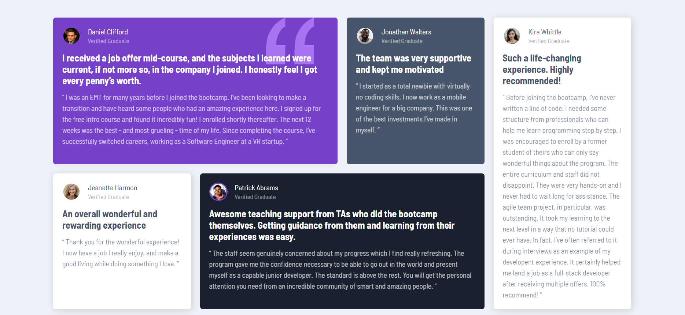

# Frontend Mentor - Testimonials grid section solution

This is a solution to the [Testimonials grid section challenge on Frontend Mentor](https://www.frontendmentor.io/challenges/testimonials-grid-section-Nnw6J7Un7). Frontend Mentor challenges help you improve your coding skills by building realistic projects. 

## Table of contents

- [Overview](#overview)
  - [The challenge](#the-challenge)
  - [Screenshot](#screenshot)
  - [Links](#links)
- [My process](#my-process)
  - [Built with](#built-with)
  - [What I learned](#what-i-learned)
  - [Useful resources](#useful-resources)
- [Author](#author)

## Overview

### The challenge

- View the optimal layout for the site depending on their device's screen size

### Screenshot

]

### Links

- Solution URL: [Solution Url](https://www.frontendmentor.io/solutions/testimonials-grid-section-p1cMtddvTS)
- Live Site URL: [Live SIte](https://varsha-viu.github.io/Testimonial-grid-section/)

## My process

### Built with

- Semantic HTML5 markup
- CSS custom properties
- Flexbox
- CSS Grid
- Mobile-first workflow

### What I learned

I have practiced CSS Grid and Flexbox extensively, which has greatly improved my ability to create complex and responsive layouts. Additionally, I've utilized the clamp function for responsive typography, ensuring that text scales smoothly across different screen sizes, enhancing the user experience on various devices.

### Useful resources

- [Grid Guid](https://css-tricks.com/snippets/css/complete-guide-grid/) - This is an amazing guide which helped me finally understand Grid. I'd recommend it to anyone still learning this concept.
- [Clamp() ](https://developer.mozilla.org/en-US/docs/Web/CSS/clamp) - This is an amazing docs which helped me finally understand clamp() function that is useful for responsive typography. I'd recommend it to anyone still learning this concept.

## Author

- Website - [Varsha Pathak]
- Frontend Mentor - [@Varsha-Viu](https://www.frontendmentor.io/profile/Varsha-Viu)
- LinkedIn - [@varsha-pathak](https://www.linkedin.com/in/varsha-pathak-0527251a1/)

